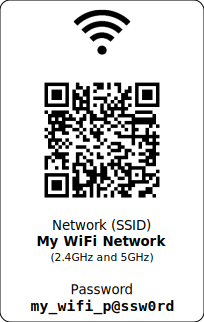

# ConnectiFy

ConnectiFy simplifies the creation of LinkCards, which provide Wi-Fi connection
details through a customizable template. These cards include all the necessary
network information and a QR code for effortless connectivity, especially for
mobile devices capable of scanning QR codes.

Optionally, you can also store this information on a credit-card sized NFC card,
which allows devices to connect by scanning the QR code or tapping the NFC card
(note: NFC functionality is not provided by this project).

**Generate your LinkCards online:** [ConnectiFy App](https://brunokc.github.io/connectify)

## Examples

Check out some sample LinkCards generated using the app:




## Usage

You have two options to generate LinkCards: online or locally.

### Online Generation

Simply use the [ConnectiFy App](https://brunokc.github.io/connectify) to create
your LinkCards.

### Local Generation

1. Clone the project repository:

```shell
$ git clone https://github.com/brunokc/connectify.git
```

2. Navigate to the project directory and activate the Python virtual environment:

```shell
$ cd connectify
$ . venv/bin/activate
```

3. Install the required dependencies:

```shell
(venv) $ pip install -r requirements.txt
```

4. Generate cards by running generate-card.py and specifying your network credentials
and the desired template:

```shell
(venv) $ python generate-card.py -t card-template.svg "My WiFi Network" "my_wifi_password" -o mycard.svg
```

5. Print the generated card (e.g., mycard.svg in the example above), and share it
with your friends or guests when they request your Wi-Fi password.

## Acknowledgements

1. https://qifi.org by Evgeni Golov
