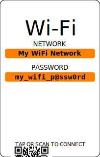

# Wi-Fi Connection Card Generator

The Wi-Fi Connection Card Generator is an app that generates Wi-Fi connection
cards based on a template of your choice. It embeds a QR codes in the generated
card that makes it easy to join a Wi-Fi network. 

Optionally, the generated card can be used as a cover for a credit-card sized
NFC card with Wi-Fi network information recorded onto it. With that set up, 
a device can join a Wi-Fi network by either scanning the QR code or by tapping
the NFC card. (NFC functionality not provided by this project).

## Examples

Here are some examples of cards generated by the generator:

<object data="./images/card3.svg" type="image/svg+xml"/>

